# Course 2: Improving Deep Neural Networks: Hyperparameter tuning, Regularization and Optimization

- [Course 2: Improving Deep Neural Networks: Hyperparameter tuning, Regularization and Optimization](#course-2-improving-deep-neural-networks-hyperparameter-tuning-regularization-and-optimization)
  - [Week 1: Practical aspects of Deep Learning](#week-1-practical-aspects-of-deep-learning)
    - [Learning Objectives](#learning-objectives)
    - [Setting up your Machine Learning Application](#setting-up-your-machine-learning-application)
      - [Train / Dev / Test sets](#train--dev--test-sets)
      - [Bias / Variance](#bias--variance)
      - [Bisic Recipe for Machine Learning](#bisic-recipe-for-machine-learning)
    - [Regularizing your neural network](#regularizing-your-neural-network)
      - [Regularization](#regularization)
      - [Why regularization reduces overfitting](#why-regularization-reduces-overfitting)
      - [Dropout Regularization](#dropout-regularization)
      - [Understanding Dropout](#understanding-dropout)
      - [Other regularization methods](#other-regularization-methods)
    - [Setting up your optimization problem](#setting-up-your-optimization-problem)
      - [Normalizing inputs](#normalizing-inputs)
      - [Vanishing / Exploding gradients](#vanishing--exploding-gradients)
      - [Weight Initialization for Deep Networks](#weight-initialization-for-deep-networks)
      - [Numerical approximation of gradients](#numerical-approximation-of-gradients)
      - [Gradient checking](#gradient-checking)
      - [Gradient checking implementation notes](#gradient-checking-implementation-notes)
  - [Week 2: Optimization algorithms](#week-2-optimization-algorithms)
    - [Learning Objectives](#learning-objectives-1)
    - [Optimization algorithms](#optimization-algorithms)
      - [Mini-batch gradient descent](#mini-batch-gradient-descent)
      - [Understanding mini-batch gradient descent](#understanding-mini-batch-gradient-descent)
      - [Exponentially Weighted Averages](#exponentially-weighted-averages)
      - [Understanding exponentially weighted averages](#understanding-exponentially-weighted-averages)
      - [Bias correction in exponentially weighted averages](#bias-correction-in-exponentially-weighted-averages)
      - [Gradient descent with momentum](#gradient-descent-with-momentum)
      - [RMSprop](#rmsprop)
      - [Adam optimization algorithm](#adam-optimization-algorithm)
      - [Learning rate decay](#learning-rate-decay)
      - [The problem of local optima](#the-problem-of-local-optima)
      - [Quick notes for optimization algorithms](#quick-notes-for-optimization-algorithms)
  - [Week 3: Hyperparameter tuning, Batch Normalization and Programming Frameworks](#week-3-hyperparameter-tuning-batch-normalization-and-programming-frameworks)
    - [Learning Objectives](#learning-objectives-2)
    - [Hyperparameter tuning](#hyperparameter-tuning)
      - [Tuning process](#tuning-process)
      - [Using an appropriate scale to pick hyperparameters](#using-an-appropriate-scale-to-pick-hyperparameters)
      - [Hyperparameters tuning in practice: Panda vs. Caviar](#hyperparameters-tuning-in-practice-panda-vs-caviar)
    - [Batch Normalization](#batch-normalization)
      - [Normalizing activations in a network](#normalizing-activations-in-a-network)
      - [Fitting Batch Norm into a neural network](#fitting-batch-norm-into-a-neural-network)
      - [Why does Batch Norm work](#why-does-batch-norm-work)
      - [Batch Norm at test time](#batch-norm-at-test-time)
    - [Multi-class classification](#multi-class-classification)
      - [Softmax Regression](#softmax-regression)
      - [Training a softmax classifier](#training-a-softmax-classifier)
    - [Introduction to programming frameworks](#introduction-to-programming-frameworks)
      - [Deep learning frameworks](#deep-learning-frameworks)
      - [Tensorflow](#tensorflow)

## Wek 1: Practical aspects of Deep Learning

### Learning Objectives

- Give examples of how different types of initializations can lead to different results
- Examine the importance of initialization in complex neural networks
- Explain the difference between train/dev/test sets
- Diagnose the bias and variance issues in your model
- Assess the right time and place for using regularization methods such as dropout or L2 regularization
- Explain Vanishing and Exploding gradients and how to deal with them
- Use gradient checking to verify the accuracy of your backpropagation implementation

### Setting up your Machine Learning Application

#### Train / Dev / Test sets

- **Hyperparameter tuning** is a very iterative process with the goal of finding the best hyperparameters on the dev set (go through the loop many times: Idea* ==> Code ==> Experiment).
  - *Ideas for improving model: e.g., # of layers, # of hidden units, learning rates, ... 

Setting up the training, development (dev, also called validate set) and test sets has a huge impact on productivity. It is important to choose the dev and test sets from the same distribution and it must be taken randomly from all the data.

*Guideline*:

- Your data will be split into three parts:
  - Training set. (Has to be the largest set) => train the model
  - Hold-out cross validation set / Development or "dev" set => model selection &/or hyperparameter tuning
  - Testing set. => final model evaluation

*Size trends*:
- If size of the dataset is 100 to 100K ==> 60/20/20
- If size of the dataset is 100K to INF ==> 98/1/1 or 99.5/0.25/0.25

*Tips*:
- Choose a dev set and test set to reflect data you expect to get in the future.
- The dev and test sets should be just big enough to represent accurately the performance of the model.
- Another trend is to train on mismatched train/test set.
  - e.g., train sets need to be very large, so we crawl from the web (image classification), but dev/test sets need to be from the same distributions.
- Its OK to only have a dev set without a testing set. 
  - Still call it a dev set as its used in the development, and not test set.


#### Bias / Variance

| error type | high variance | high bias | high bias, high variance | low bias, low variance | note |
| :---- | :----: | :----: | :----: | :----: | :----: |
| Train set error | 1% | 15% | 15% | 0.5% | tells if we have bias problem |
| Dev set error | 11% | 16% | 30% | 1% | tells if we have variance problem (diff. with train error) |

_Notes_<br>
- Underfitting -> High bias
- Overfitting -> High variance
- High bias & high variance case: e.g., with linear classifiers, where you underfit, but overfit parts of the data as well. 
- Goal -> Balance the two (trade-off)
- Assumptions:
  - Ass.1: Evaluation on the table above came from the fact that human has 0% error (optimal/Bayes error).
    - If the human error was 15%, the assessment would change (e.g., the 2nd column would be low bias & variance now) 
  - Ass.2: Train and dev set come from same distribution  

> When we discuss prediction models, prediction errors can be decomposed into two main subcomponents we care about: error due to "bias" and error due to "variance". There is a tradeoff between a model's ability to minimize bias and variance. Understanding these two types of error can help us diagnose model results and avoid the mistake of over- or under-fitting.


To understand bias and variance better, read this essay: [Understanding the Bias-Variance Tradeoff][bias-variance-tradeoff].

#### Basic Recipe for Machine Learning

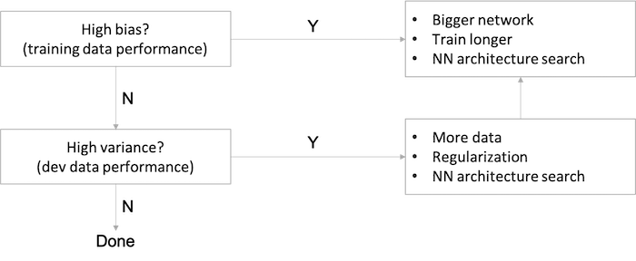

- For a high bias problem, getting more training data is actually not going to help. (but will reduce variance)
- Back in the pre-deep learning era, we didn't have as many tools that just reduce bias or that just reduce variance without hurting the other one. (aka bias/variance trade-off)
- In the modern deep learning, big data era, **getting a bigger network and more data almost always just reduces bias without necessarily hurting your variance, so long as you regularize appropriately**. 
- This has been one of the big reasons that deep learning has been so useful for supervised learning.
- The main cost of training a big neural network is just computational time, so long as you're regularizing. 

You should try the previous two points until you have a low bias and low variance.

### Regularizing your neural network

#### Regularization

**Regularization for Logistic Regression**:

**Regularization** is a method to reduce overfitting (variance). 

#TODO: add math equations

- Remember we want to min J(w, b)...
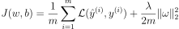

- `b` is just one parameter over a very large number of parameters, so no need to include it in the regularization.
- first term: cost function, 2nd: regularisation
- `lambda` here is the regularization parameter (hyperparameter), set using the dev set

| regularization | formula | description |
| :---- | :----: | :---- |
| L2 regularization | 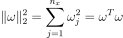 | most common type of regularization |
| L1 regularization | 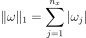 | w vector will have a lot of zeros, so L1 regularization makes your model sparse (feature selection) |

- L1 matrix norm:
  - `||W|| = Sum(|w[i,j]|)  # sum of absolute values of all w`
- L2 matrix norm:
  - `||W||^2 = Sum(|w[i,j]|^2)	# sum of all w squared`
  - Also can be calculated as `||W||^2 = W.T * W if W is a vector`

- Regularization for logistic regression:
  - The normal cost function that we want to minimize is: `J(w,b) = (1/m) * Sum(L(y(i),y'(i)))`
  - The L2 regularization version: `J(w,b) = (1/m) * Sum(L(y(i),y'(i))) + (lambda/2m) * Sum(|w[i]|^2)`
  - The L1 regularization version: `J(w,b) = (1/m) * Sum(L(y(i),y'(i))) + (lambda/2m) * Sum(|w[i]|)`
  - The L1 regularization version makes a lot of w values become zeros, which makes the model size smaller.
  - L2 regularization is being used much more often.

**Regularization for a Neural Network**:

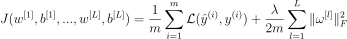
- The normal cost function that we want to minimize is:   
  `J(W1,b1...,WL,bL) = (1/m) * Sum(L(y(i),y'(i)))`
- The L2 regularization version:   
  `J(w,b) = (1/m) * Sum(L(y(i),y'(i))) + (lambda/2m) * Sum((||W[l]||^2)`
- We stack the matrix as one vector `(mn,1)` and then we apply `sqrt(w1^2 + w2^2.....)`

For the matrix `w`, this norm is called the Frobenius norm. Its definition looks like `L2` norm but is not called the `L2` norm:

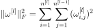
- 1st summation: # of neurons in current layer, 2nd: # neurons in previous layer 

Regularization of gradient:

- To do back propagation (old way):   
  `dw[l] = (from back propagation)`
- The new way:   
  `dw[l] = (from back propagation) + lambda/m * w[l]`

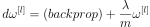

With regularization the coefficient of `w` is slightly less than `1`, in which case it is called **weight decay**.
- So plugging it in weight update step:
    - ```
      w[l] = w[l] - learning_rate * dw[l]
           = w[l] - learning_rate * ((from back propagation) + lambda/m * w[l])
           = w[l] - (learning_rate*lambda/m) * w[l] - learning_rate * (from back propagation) 
           = (1 - (learning_rate*lambda)/m) * w[l] - learning_rate * (from back propagation)
      ```

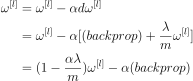

- In practice this penalizes large weights and effectively limits the freedom in your model.
- The new term `(1 - (learning_rate*lambda)/m) * w[l]`  causes the **weight to decay** in proportion to its size.


#### Why regularization reduces overfitting

- Intuition 1:
  - If we make regularization lambda to be very big, then weight matrices (`w`'s) will be set to be reasonably close to zero, effectively zeroing out a lot of the impact of the hidden units. Then the simplified neural network becomes a much smaller neural network, eventually almost like a logistic regression (smoother decision boundaries). We'll end up with a much smaller network that is therefore less prone to overfitting (since it will reduce some weights that makes the neural network overfit). If `lambda` too high, it can increase bias though, so we need to find the correct value.
- Intuition 2 (with _tanh_ activation function):
  - Taking activation function `g(Z)=tanh(Z)` as example, if lambda is large, then weights `W` are small and subsequently `Z` ends up taking relatively small values, where `g` and `Z` will be roughly linear which is not able to fit those very complicated decision boundary, i.e., less able to overfit. (will use the linear part of the _tanh_ activation function, so we will go from non linear activation to _roughly_ linear which would make the NN a _roughly_ linear classifier.)

*Implementation tips*:

Without regularization term, we should see the cost function decreases **monotonically** in the learning curve plot (`J` vs no. of iterations). Whereas in the case of regularization, to debug gradient descent make sure that we plot `J` with a regularization term; otherwise, if we plot only the first term (the old J), we might not see a decrease monotonically.

_**Implementation tip**_: if you implement gradient descent, one of the steps to debug gradient descent is to plot the cost function J as a function of the number of iterations of gradient descent and you want to see that the cost function J decreases **monotonically** after every elevation of gradient descent with regularization. If you plot the old definition of J (no regularization) then you might not see it decrease monotonically.

#### Dropout Regularization

- Dropout is another powerful regularization technique.
- With dropout, what we're going to do is go through each of the layers of the network and set some probability of eliminating a node in neural network (`keep_prob = 0.5` a common value). 
  - It's as if on every iteration you're working with a smaller neural network, which has a regularizing effect.
- Inverted dropout technique, `a3 = a3 / keep_prob`, ensures that the expected value of `a3` remains the same, which makes test time easier because you have less of a scaling problem. 
- In most cases Andrew Ng tells that he uses the L2 regularization.

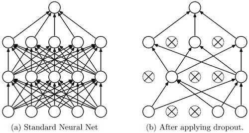

*(image source: [deepnotes](https://deepnotes.io/dropout))*

- Code for Inverted dropout:

  ```python
  keep_prob = 0.8   # 0 <= keep_prob <= 1
  l = 3  # this code is only for layer 3
  # the generated number that are less than 0.8 will be dropped. 80% stay, 20% dropped
  d3 = np.random.rand(a[l].shape[0], a[l].shape[1]) < keep_prob

  a3 = np.multiply(a3,d3)   # keep only the values in d3

  # increase a3 to not reduce the expected value of output
  # (ensures that the expected value of a3 remains the same) - to solve the scaling problem
  a3 = a3 / keep_prob       
  ```
- Vector d[l] is used for forward and back propagation and is the same for them, but it is different for each iteration (pass) or training example.
- At test time we don't use dropout. If you implement dropout at test time - it would add noise to predictions.


#### Understanding Dropout

- Intuition 1: Dropout randomly knocks out units in your network. So it's as if on every iteration you're working with a smaller NN, and so using a smaller NN seems like it should have a regularizing effect.
- Intuition 2: Can't rely on any one feature, so have to spread out weights, which has an effect of shrinking the squared norm of the weights, similar to what we saw with L2 regularization, helping prevent overfitting.
- For layers where you're more worried about over-fitting, really the layers with a lot of parameters, you can set the key prop to be smaller to apply a more powerful form of drop out (so different `keep_prob` per layer). 
  - The input layer dropout has to be near 1 (or 1 - no dropout) because you don't want to eliminate a lot of features.
  - Downside: this gives you even more hyperparameters to search for using cross-validation. One other alternative might be to have some layers where you apply dropout and some layers where you don't apply dropout and then just have one hyperparameter, which is a `keep_prob` for the layers for which you do apply dropouts.
- Frequently used in computer vision, as the input size is so big, inputting all these pixels that you almost never have enough data, prone to overfitting.
- Cost function `J` is no longer well-defined and harder to debug or double check that `J` is going downhill on every iteration. 
  - To solve that you'll need to turn off dropout, set all the `keep_prob`s to 1, and then run the code and check that it monotonically decreases J and then turn on the dropouts again.

*Note*:

- A **common mistake** when using dropout is to use it both in training and testing. You should use dropout (randomly eliminate nodes) only in training.
- Deep learning frameworks like [tensorflow](https://www.tensorflow.org/api_docs/python/tf/nn/dropout), [PaddlePaddle](https://www.paddlepaddle.org.cn/documentation/docs/en/api/layers/dropout.html), [keras](https://keras.io/api/layers/regularization_layers/dropout/) or [caffe](http://caffe.berkeleyvision.org/tutorial/layers/dropout.html) come with a dropout layer implementation. 


#### Other regularization methods

- **Data augmentation**: getting more training data can be expensive and sometimes can't get more data, so flipping horizontally, random cropping, random distortion and translation of image can make additional fake training examples (`m` more instances each).
  - New data obtained using this technique isn't as good as the real independent data, but still can be used as a regularization technique.
- **Early stopping**: stopping halfway to get a mid-size `w`.
  - In this technique we plot the training set and the dev set cost together for each iteration. At some iteration the dev set cost will stop decreasing and will start increasing.
    - We will pick the point at which the training set error and dev set error are best (lowest training cost with lowest dev cost).
  - *Disadvantage*: early stopping couples two tasks of machine learning, optimizing the cost function `J` and not overfitting, which are supposed to be completely separate tasks, to make things more complicated (affects both bias and variance).
  - *Advantage*: running the gradient descent process just once, you get to try out values of small `w`, mid-size `w`, and large `w`, without needing to try a lot of values of the L2 regularization hyperparameter lambda.
- **Model Ensembles**:
  - Algorithm:
    - Train multiple independent models.
    - At test time average their results.
  - It can get you extra 2% performance.
  - It reduces the generalization error.
  - You can use some snapshots of your NN at the training ensembles them and take the results.
  
Related to **orthogonalization**, explained later, stay tuned!

### Setting up your optimization problem

#### Normalizing inputs

With normalization, cost function will be more round and easier to optimize (faster) when features are all on similar scales. This is a very common topic, see more on [Stack Overflow][normalizing].

- If you normalize your inputs this will speed up the training process a lot.
- Normalization are going on these steps:
  1. Get the mean of the training set: `mean = (1/m) * sum(x(i))`
  2. Subtract the mean from each input: `X = X - mean`
     - This makes your inputs centered around 0.
  3. Get the variance of the training set: `variance = (1/m) * sum(x(i)^2)`
  4. Normalize the variance. `X /= variance`
- These steps should be applied to training, dev, and testing sets (but using mean and variance of the train set).

_Why normalize?_<br>
  - If we don't normalize the inputs our cost function will be deep and its shape will be inconsistent (elongated) then optimizing it will take a long time.
  - But if we normalize it the opposite will occur. The shape of the cost function will be consistent (look more symmetric like circle in 2D example) and we can use a larger learning rate alpha - the optimization will be faster.

#### Vanishing / Exploding gradients

- Vanishing / Exploding gradients occurs when your derivatives become very small or very big.
  - In a very deep network derivatives or slopes can sometimes get either very big or very small, maybe even exponentially, and this makes training difficult.
- The weights `W`, if they're all just a little bit bigger than one or just a little bit bigger than the identity matrix, then with a very deep network the activations can explode. And if W is just a little bit less than identity, the activations will decrease exponentially.

- To understand the problem, suppose that we have a deep neural network with number of layers L, and all the activation functions are **linear** and each `b = 0`
  - Then:   
    ```
    Y' = W[L]W[L-1].....W[2]W[1]X
    ```
  - Then, if we have 2 hidden units per layer and x1 = x2 = 1, we result in:

    ```
    if W[l] = [1.5   0] 
              [0   1.5] (l != L because of different dimensions in the output layer)
    Y' = W[L] [1.5  0]^(L-1) X = 1.5^L 	# which will be very large
              [0  1.5]
    ```
    ```
    if W[l] = [0.5  0]
              [0  0.5]
    Y' = W[L] [0.5  0]^(L-1) X = 0.5^L 	# which will be very small
              [0  0.5]
    ```
- The last example explains that the activations (and similarly derivatives) will be decreased/increased exponentially as a function of number of layers.
  - So If W > I (Identity matrix) the activation and gradients will explode.
  - And If W < I (Identity matrix) the activation and gradients will vanish.
- There is a partial solution that doesn't completely solve this problem but it helps a lot - careful choice of how you initialize the weights (next video).


#### Weight Initialization for Deep Networks

A partial solution to the problems of vanishing and exploding gradients is better or more careful choice of the random initialization for neural network.

For a single neuron, suppose we have `n` features for the input layer, then we want `Z = W1X1 + W2X2 + ... + WnXn` not blow up and not become too small, so the larger `n` is, the smaller we want `Wi` to be.

- It's reasonable to set variance of `Wi` to be equal to `1/n`
- It helps reduce the vanishing and exploding gradients problem, because it's trying to set each of the weight matrices `W` not too much bigger than `1` and not too much less than `1`.
- Generally for layer `l`, set `W[l]=np.random.randn(shape) * np.sqrt(1/n[l-1])`.
  - For `relu` activation, set `Var(W)=2/n` by `W[l]=np.random.randn(shape) * np.sqrt(2/n[l-1])`. (aka He initialization by [Kaiming He](http://kaiminghe.com/))
  - For `tanh` activation, `W[l]=np.random.randn(shape) * np.sqrt(1/n[l-1])`. (Xavier initialization)
  - `W[l]=np.random.randn(shape) * np.sqrt(2/(n[l-1]+n[l]))` (Yoshua Bengio)
- `1` or `2` in variance `Var(W)=1/n or 2/n` can be a hyperparameter, but not as important as other hyperparameters.

*A well chosen initialization can*:

- Speed up the convergence of gradient descent
- Increase the odds of gradient descent converging to a lower training (and generalization) error

*Implementation tips*:

- The weights `W[l]` should be initialized randomly to *break symmetry* and make sure different hidden units can learn different things. Initializing all the weights to zero results in the network failing to break symmetry. This means that every neuron in each layer will learn the same thing.
- It is however okay to initialize the biases `b[l]` to zeros. Symmetry is still broken so long as `W[l]` is initialized randomly.
- Different initializations lead to different results
- Initializing weights to very large random values does not work well.
- Hopefully intializing with small random values does better. The important question is: how small should be these random values be? He initialization works well for networks with ReLU activations. In other cases, try other initializations.

#### Numerical approximation of gradients

Numerically verify implementation of derivative of a function is correct and hence to check if there is a bug in the backpropagation implementation.

*Two-sided difference formula is much more accurate*:

- In two side case, `f'(𝜃)=lim(f(𝜃+𝜀)-f(𝜃-𝜀))/(2𝜀), error term ~ O(𝜀^2)`
- In one side case, `f'(𝜃)=lim(f(𝜃+𝜀)-f(𝜃))/(𝜀), error term ~ O(𝜀)`
- `𝜀 < 1`, so `O(𝜀^2) < O(𝜀)`

#### Gradient checking

- Gradient checking approximates the gradients and is very helpful for finding the errors in your backpropagation implementation but it's slower than gradient descent (so use only for debugging).

*Implementation steps*:

1. Take `W[1],b[1],...,W[L],b[L]` and reshape into a big vector `𝜃`: `J(W[1],b[1],...,W[L],b[L])=J(𝜃)`.
2. Take `dW[1],db[1],...,dW[L],db[L]` and reshape into a big vector `d𝜃`.
3. For each `i`: `d𝜃_approx[i] = (J(𝜃1,𝜃2,...,𝜃i+𝜀,...)-J(𝜃1,𝜃2,...,𝜃i-𝜀,...))/(2𝜀)`. (Should have `d𝜃_approx[i] ≈ d𝜃[i]`)
4. Check `diff_ratio = norm_2(d𝜃_approx-d𝜃) / (norm_2(d𝜃_approx)+norm_2(d𝜃)) ≈ eps`:
   1. `diff_ratio ≈ 10^-7`, great, backprop is very likely correct.
   2. `diff_ratio ≈ 10^-5`, maybe OK, better check no component of this difference is particularly large.
   3. `diff_ratio ≈ 10^-3`, worry, check if there is a bug.

#### Gradient checking implementation notes

- Don't use in training - only to debug (it's very slow)
- If algorithm fails grad check, look at components to try to identify bug.
- Remember regularization. (add `lamda/(2m) * sum(W[l])` to `J`)
- Doesn't work with dropout. (you can first check grad, then turn on dropout)
- Run at random initialization; perhaps again after some training.

### Regularization summary

#### 1. L2 Regularization   
**Observations**:   
  - The value of λ is a hyperparameter that you can tune using a dev set.
  - L2 regularization makes your decision boundary smoother. If λ is too large, it is also possible to "oversmooth", resulting in a model with high bias.

**What is L2-regularization actually doing?**:   
  - L2-regularization relies on the assumption that a model with small weights is simpler than a model with large weights. Thus, by penalizing the square values of the weights in the cost function you drive all the weights to smaller values. It becomes too costly for the cost to have large weights! This leads to a smoother model in which the output changes more slowly as the input changes.

**What you should remember:**   
Implications of L2-regularization on:
  - cost computation:
    - A regularization term is added to the cost
  - backpropagation function:
    - There are extra terms in the gradients with respect to weight matrices
  - weights:
    - weights end up smaller ("weight decay") - are pushed to smaller values.
    
#### 2. Dropout   
**What you should remember about dropout:**   
- Dropout is a regularization technique.
- You only use dropout during training. Don't use dropout (randomly eliminate nodes) during test time.
- Apply dropout both during forward and backward propagation.
- During training time, divide each dropout layer by keep_prob to keep the same expected value for the activations. For example, if `keep_prob` is 0.5, then we will on average shut down half the nodes, so the output will be scaled by 0.5 since only the remaining half are contributing to the solution. Dividing by 0.5 is equivalent to multiplying by 2. Hence, the output now has the same expected value. You can check that this works even when keep_prob is other values than 0.5.


## Week 2: Optimization algorithms

### Learning Objectives

- Apply optimization methods such as (Stochastic) Gradient Descent, Momentum, RMSProp and Adam
- Use random minibatches to accelerate convergence and improve optimization
- Describe the benefits of learning rate decay and apply it to your optimization

### Optimization algorithms

#### Mini-batch gradient descent

Vectorization allows you to process all M examples relatively quickly if M is very large, but it can still be slow and cause memory issues. For example, `m = 5,000,000` (or `m = 50,000,000` or even bigger), we have to process the entire training sets of five million training samples before we take one little step of gradient descent.

We can use the mini-batch method to let gradient descent start to make some progress (parallelised) before we finish processing the entire, giant training set of 5 million examples by splitting up the training set into smaller, little baby training sets called **mini-batches**. In this case, we have 5000 mini-batches with 1000 examples each.
- So the definition of mini batches ==> `t: X{t}, Y{t}`.

*Notations*:

- `(i)`: the *i*-th training sample
- `[l]`: the *l*-th layer of the neural network
- `{t}`: the *t*-th mini batch

In every step of the iteration loop, we need to loop for `num_batches` and do forward and backward computation for each batch.

1. Forward propagation (vectorised implementation) #TODO: add equations
2. Compute cost function
3. Backward propagation to compute gradients
4. Update parameters (using parameters, and grads from backprop)

With mini-batch gradient descent, a single pass through the training set is one epoch, which in the above 5 million example, means 5000 gradient descent steps.
- Mini-batch gradient descent works much faster in the large datasets, so it is the default in TF.

- In **Batch gradient descent** we run the gradient descent on the whole dataset.
- While in **Mini-Batch gradient descent** we run the gradient descent on the mini datasets.
- Mini-Batch algorithm pseudo code:
  ```
  for t = 1:No_of_batches                         # this is called an epoch
  	AL, caches = forward_prop(X{t}, Y{t})
  	cost = compute_cost(AL, Y{t})
  	grads = backward_prop(AL, caches)
  	update_parameters(grads)
  ```
- The code inside an epoch should be vectorized.


#### Understanding mini-batch gradient descent

| batch size | method | description | guidelines |
| :---- | :----: | :---- | :---- |
| =`m` | batch gradient descent | cost function decreases on every iteration;<br>but too long per iteration. | for a small training set (<2000). |
| =`1` | stochastic gradient descent | cost function oscillates, can be extremely noisy;<br>wander around minimum;<br>lose speedup from vectorization, inefficient. | use a smaller learning rate when it oscillates too much. |
| between `1` and `m` | mini-batch gradient descent | somewhere in between, vectorization advantage, faster;<br>not guaranteed to always head toward the minimum but more consistently in that direction than stochastic descent;<br>not always exactly converge, may oscillate in a very small region (in its learning curves), reducing the learning rate slowly may also help. | mini-batch size is a hyperparameter;<br>batch size better in [64, 128, 256, 512], a power of 2;<br>make sure that mini-batch fits in CPU/GPU memory. |

- Guidelines for choosing mini-batch size:
  1. If small training set (< 2000 examples) - use batch gradient descent.
  2. It has to be a power of 2 (because of the way computer memory is layed out and accessed, sometimes your code runs faster if your mini-batch size is a power of 2):
    `64, 128, 256, 512, 1024, ...`
  3. Make sure that mini-batch fits in CPU/GPU memory.


#### Exponentially Weighted Averages

Moving averages are favored statistical tools of active traders to measure momentum (by smoothing out noisy time series data). There are three MA methods:

| MA methods | calculations |
| :---- | :---- |
| simple moving average (SMA) |	calculated from the average closing prices for a specified period |
| weighted moving average (WMA) |	calculated by multiplying the given price by its associated weighting (assign a heavier weighting to more current data points) and totaling the values |
| exponential moving average (EWMA) | also weighted toward the most recent prices, but the rate of decrease is exponential |

For a list of daily temperatures:

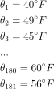

This data looks a little bit noisy (blue dots):

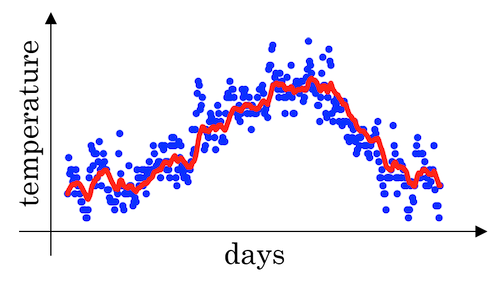

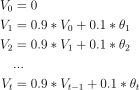

If we want to compute the trends, by averaging over a larger window, the above exponentially weighted average formula adapts more slowly when the temperature changes. So, there's just a bit more latency. (See the red curve above)

- General equation
  ```
  V(t) = beta * v(t-1) + (1-beta) * theta(t)
  ```

- When `β=0.98` then it's giving a lot of weight to the previous value and a much smaller weight just 0.02, to whatever you're seeing right now. (See the green curve below)
- When `β=0.5`, which something like averaging over just two days temperature. And by averaging only over two days temperature, as if averaging over much shorter window. It's much more noisy, much more susceptible to outliers. But this adapts much more quickly to what the temperature changes. (See the yellow curve below)
- If we plot this it will represent averages over `~ (1 / (1 - beta))` entries:
    - `beta = 0.9` will average last 10 entries
    - `beta = 0.98` will average last 50 entries
    - `beta = 0.5` will average last 2 entries
- Best beta average for our case is between 0.9 and 0.98

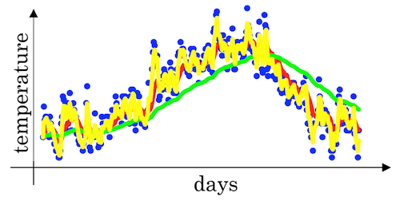

- **Intuition**: The reason why exponentially weighted averages are useful for further optimizing gradient descent algorithm is that it can give different weights to recent data points (`theta`) based on value of `beta`. If `beta` is high (around 0.9), it smoothens out the averages of skewed data points (oscillations w.r.t. Gradient descent terminology). So this reduces oscillations in gradient descent and hence makes faster and smoother path towards minima.

#### Understanding exponentially weighted averages

This topic is basically related to [gradient descent optimizations][gradient-descent-ewa].

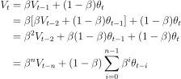

The exponentially weighted average adds a fraction β of the current value to a leaky running sum of past values. Effectively, the contribution from the *t−n*th value is scaled by 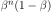.

For example, here are the contributions to the current value after 5 iterations (iteration 5 is the current iteration)

| iteration | contribution |
| :----: | :----: |
| 1 | `β^4(1−β)` |
| 2 | `β^3(1−β)` |
| 3 | `β^2(1−β)` |
| 4 | `β^1(1−β)` |
| 5 | `(1−β)` |

Since `β<1`, the contribution decreases exponentially with the passage of time. Effectively, this acts as a smoother for a function.

- We can implement this algorithm with more accurate results using a moving window. But the code is more efficient and faster using the exponentially weighted averages algorithm.
- Algorithm is very simple and it is low in memory requirements (since it overwrites previous values):
  ```
  v = 0
  Repeat
  {
  	Get theta(t)
  	v = beta * v + (1-beta) * theta(t)
  }
  ```

***e*-folding**:

Andrew Ng also mentioned an interesting concept related to *e*-folding. He said:

- if `β=0.9` it would take about 10 days for `V` to decay to about `1/3` (`1/e ≈ 1/3`) of the peak;
- if `β=0.98` it would be 50 days.

Here 10 or 50 days is called one lifetime (1 *e*-folding). Generally, for an exponential decay quantity, after one lifetime (`1/(1-β)` iterations), `1/e ≈ 37%` is remained and after two lifetime, `1/e^2 ≈ 14%` is left. 

For more information, check the definition of [*e*-folding][e-folding].

#### Bias correction in exponentially weighted averages

There's one technical detail called biased correction that can make you computation of these averages more accurately. In the temperature example above, when we set `β=0.98`, we won't actually get the green curve; instead, we get the purple curve (see the graph below). 

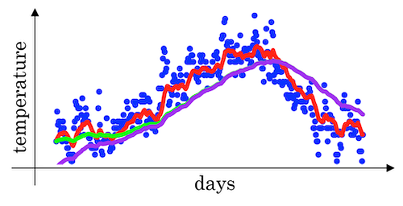

Because when we're implementing the exponentially weighted moving average, we initialize it with `V0=0`, subsequently we have the following result in the beginning of the iteration:

- `V1 = 0.98*V0 + 0.02*θ1 = 0.02 * θ1`
- `V2 = 0.98*V1 + 0.02*θ2 = 0.0196 * θ1 + 0.02 * θ2`

As a result, `V1` and `V2` calculated by this are not very good estimates of the first two temperature. So we need some modification to make it more accurate, especially during the initial phase of our estimate to avoid an **initial bias**. This can be corrected by scaling with `1/(1-β^t)` where `t` is the iteration number.

| original | correction |
| :----: | :----: |
| 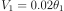 | 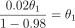 |
| 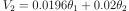 | 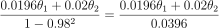 |

- To solve the bias issue we have to use this equation:
  ```
  v(t) = (beta * v(t-1) + (1-beta) * theta(t)) / (1 - beta^t)
  ```
- As t becomes larger the `(1 - beta^t)` becomes close to `1`

#### Gradient descent with momentum

Because mini-batch gradient descent makes a parameter update after seeing just a subset of examples, the direction of the update has some variance, and so the path taken by mini-batch gradient descent will "oscillate" toward convergence. Using momentum can reduce these oscillations amd move to the goal faster. 

- gradient descent with momentum, which computes an EWA of gradients to update weights almost always works faster than the standard gradient descent algorithm.
- algorithm has two hyperparameters of `alpha`, the learning rate, and `beta` which controls your exponentially weighted average. common value for `beta` is `0.9`.
- don't bother with bias correction

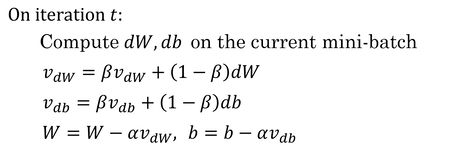

*Implementation tips*:

- If `β = 0`, then this just becomes standard gradient descent without momentum. 
- The larger the momentum `β` is, the smoother the update because the more we take the past gradients into account. But if `β` is too big, it could also smooth out the updates too much. 
- Common values for `β` range from `0.8` to `0.999`. If you don't feel inclined to tune this, `β = 0.9` is often a reasonable default. 
- It can be applied with batch gradient descent, mini-batch gradient descent or stochastic gradient descent.

- Pseudo code:
  ```
  vdW = 0, vdb = 0
  on iteration t:
  	# can be mini-batch or batch gradient descent
  	compute dw, db on current mini-batch                
  			
  	vdW = beta * vdW + (1 - beta) * dW
  	vdb = beta * vdb + (1 - beta) * db
  	W = W - learning_rate * vdW
  	b = b - learning_rate * vdb
  ```
- Momentum helps the cost function to go to the minimum point in a more fast and consistent way.

#### RMSprop

RMSprop(root mean square), similar to momentum, has the effects of damping out the oscillations in gradient descent and mini-batch gradient descent and allowing you to maybe use a larger learning rate alpha.

The algorithm computes the exponentially weighted averages of the squared gradients and updates weights by the square root of the EWA.

```python
s_dW = 0, s_db = 0
for iteration t:
  # compute dW, db on mini-batch

  S_dW = (beta * S_dW) + (1 - beta) * dW^2  # squaring is element-wise
  S_db = (beta * S_db) + (1 - beta) * db^2
  W = W - alpha * dW / sqrt(S_dW + 𝜀)   # 𝜀: small number(10^-8) to avoid dividing by zero
  b = b - alpha * db / sqrt(S_db + 𝜀)
```
- Ensure that `s_dW` is not zero by adding a small value `epsilon` (e.g. `epsilon = 10^-8`) to it:   
   `W = W - learning_rate * dW / (sqrt(s_dW) + epsilon)`
- With RMSprop you can increase your learning rate.

#### Adam optimization algorithm

- Adam (Adaptive Moment Estimation) optimization algorithm is basically putting momentum and RMSprop together and combines the effect of gradient descent with momentum together with gradient descent with RMSprop.
- This is a commonly used learning algorithm that is proven to be very effective for many different neural networks of a very wide variety of architectures.
- In the typical implementation of Adam, bias correction is on.

```python
V_dW = 0
V_db = 0
S_dW = 0
S_db = 0

for iteration t:
  # compute dW, db using mini-batch                
  
  # momentum
  V_dW = (beta1 * V_dW) + (1 - beta1) * dW     
  V_db = (beta1 * V_db) + (1 - beta1) * db     
  
  # RMSprop
  S_dW = (beta2 * S_dW) + (1 - beta2) * dW^2   
  S_db = (beta2 * S_db) + (1 - beta2) * db^2   
  
  # bias correction
  V_dW_c = V_dW / (1 - beta1^t)      
  V_db_c = V_db / (1 - beta1^t)
  S_dW_c = S_dW / (1 - beta2^t)
  S_db_c = S_db / (1 - beta2^t)
          
  W = W - alpha * V_dW_c / (sqrt(S_dW_c) + 𝜀)
  b = b - alpha * V_db_c / (sqrt(S_db_c) + 𝜀)
```

*Implementation tips*:

1. It calculates an exponentially weighted average of past gradients, and stores it in variables `V_dW,V_db` (before bias correction) and `V_dW_c,V_db_c` (with bias correction). 
2. It calculates an exponentially weighted average of the squares of the past gradients, and stores it in variables `S_dW,S_db` (before bias correction) and `S_dW_c,S_db_c` (with bias correction). 
3. It updates parameters in a direction based on combining information from "1" and "2".

| hyperparameter | guideline |
| :---- | :---- |
| `learning rate` | tune |
| `beta1` (parameter of the momentum, for `dW`) | `0.9` |
| `beta2` (parameter of the RMSprop, for `dW^2`) | `0.999` |
| `𝜀` (avoid dividing by zero) | `10^-8` |

Adam paper: [Adam: A Method for Stochastic Optimization][adam]

#### Learning rate decay

The learning algorithm might just end up wandering around, and never really converge, because you're using some fixed value for alpha. Learning rate decay methods can help by making learning rate smaller when optimum is near. There are several decay methods:

- One technique equations is`learning_rate = (1 / (1 + decay_rate * epoch_num)) * learning_rate_0`  
  - `epoch_num` is over all data (not a single mini-batch).

| decay factor | description |
| :---- | :---- |
| `0.95^epoch_num` | exponential decay |
| `k/sqrt(epoch_num)` or `k/sqrt(t)` | polynomial decay |
| discrete staircase | piecewise constant |
| manual decay | -- |

- `decay_rate` is another `hyperparameter`.
- For Andrew Ng, learning rate decay has less priority.

#### The problem of local optima

- First, you're actually pretty unlikely to get stuck in bad local optima, but much more likely to run into a saddle point, so long as you're training a reasonably large neural network, save a lot of parameters, and the cost function J is defined over a **relatively high dimensional space**.
- Second, that plateaus (region where the derivative is close to zero for a long time) are a problem and you can actually make learning pretty slow. And this is where algorithms like **momentum** or **RMSProp** or **Adam** can really help your learning algorithm.

This is what a saddle point look like.

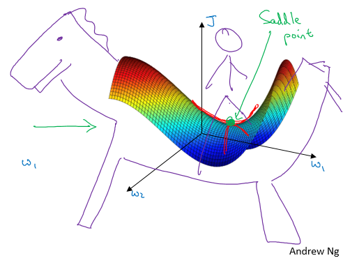

#### Quick notes for optimization algorithms

Recall that in [Course 1](../C1-Neural-Networks-and-Deep-Learning/readme.md#building-blocks-of-deep-neural-networks) we have already known that there are several steps in the neural network implementation:

1. Initialize parameters / Define hyperparameters
2. Loop for num_iterations:
   1. Forward propagation
   2. Compute cost function
   3. Backward propagation
   4. **Update parameters (using parameters, and grads from backprop)**
3. Use trained parameters to predict labels

When we create `momentum`, `RMSprop` or `Adam` optimization methods, what we do is to implement algorithms in the **update parameters** step. A good practice is to wrap them up as options so we can compare them during our alchemy training：

```python
if optimizer == "gd":
    parameters = update_parameters_with_gd(parameters, grads, learning_rate)
elif optimizer == "momentum":
    parameters, v = update_parameters_with_momentum(parameters, grads, v, beta, learning_rate)
elif optimizer == "adam":
    t = t + 1 # Adam counter
    parameters, v, s = update_parameters_with_adam(parameters, grads, v, s, t, learning_rate, beta1, beta2, epsilon)
```

## Week 3: Hyperparameter tuning, Batch Normalization and Programming Frameworks

### Learning Objectives

- Master the process of hyperparameter tuning

### Hyperparameter tuning

#### Tuning process

Importance of hyperparameters (roughly):

| importance level | hyperparameters |
| :----: | :---- |
| first | learning rate `alpha` |
| second | momentum term `beta`<br>mini-batch size<br>number of hidden units |
| third | number of layers<br>learning rate decay<br>Adam `beta1, beta2, epsilon` |

*Tuning tips*:

- Choose points at random, not in a grid
- Optionally use a coarse to fine search process


- We need to tune our hyperparameters to get the best out of them.

  6. Learning rate decay.
  7. Regularization lambda.
  8. Activation functions.
  9. Adam `beta1`, `beta2` & `epsilon`.

- Its hard to decide which hyperparameter is the most important in a problem. It depends a lot on your problem.
- One of the ways to tune is to sample a grid with `N` hyperparameter settings and then try all settings combinations on your problem.
- Try random values: don't use a grid.
- You can use `Coarse to fine sampling scheme`:
  - When you find some hyperparameters values that give you a better performance - zoom into a smaller region around these values and sample more densely within this space.
- These methods can be automated.


#### Using an appropriate scale to pick hyperparameters

Search for hyperparameters on a log scale.

```python
r = -4 * np.random.rand() # r in [-4,0]
alpha = 10**r             # alpha in [10^-4, 1]
```

It's easy to extend to a more generalized case `[a,b]`.

As for `beta`, use the same logarithmic scale method for `1-beta`.


- Let's say you have a specific range for a hyperparameter from "a" to "b". It's better to search for the right ones using the logarithmic scale rather then in linear scale:
  - Calculate: `a_log = log(a)  # e.g. a = 0.0001 then a_log = -4`
  - Calculate: `b_log = log(b)  # e.g. b = 1  then b_log = 0`
  - Then:
    ```
    r = (a_log - b_log) * np.random.rand() + b_log
    # In the example the range would be from [-4, 0] because rand range [0,1)
    result = 10^r
    ```
    It uniformly samples values in log scale from [a,b].
- If we want to use the last method on exploring on the "momentum beta":
  - Beta best range is from 0.9 to 0.999.
  - You should search for `1 - beta in range 0.001 to 0.1 (1 - 0.9 and 1 - 0.999)` and the use `a = 0.001` and `b = 0.1`. Then:
    ```
    a_log = -3
    b_log = -1
    r = (a_log - b_log) * np.random.rand() + b_log
    beta = 1 - 10^r   # because 1 - beta = 10^r
    ```


#### Hyperparameters tuning in practice: Panda vs. Caviar

- Intuitions about hyperparameter settings from one application area may or may not transfer to a different one.

- **Panda approach**: Not enough computational capacity: babysitting one model
  - Day 0 you might initialize your parameter as random and then start training.
  - Monitor your learning curve gradually decrease over the day.
  - Each day you nudge your parameters a little during training.

- **Caviar approach**: training many models in parallel


- Intuitions about hyperparameter settings from one application area may or may not transfer to a different one.
- If you don't have much computational resources you can use the "babysitting model":
  - Day 0 you might initialize your parameter as random and then start training.
  - Then you watch your learning curve gradually decrease over the day.
  - And each day you nudge your parameters a little during training.
  - Called panda approach.
- If you have enough computational resources, you can run some models in parallel and at the end of the day(s) you check the results.
  - Called Caviar approach.


### Batch Normalization

#### Normalizing activations in a network

- Batch normalization makes your hyperparameter search problem much easier, makes your neural network much more robust, and faster to train.
- Before (in the input layer and logreg) we normalized the inputs by subtracting the mean and dividing by variance. This helped a lot for the shape of the cost function and for reaching the minimum point faster.
  - The question is: for any hidden layer can we normalize `A[l]` to train `W[l+1]` , `b[l+1]` (since `A[l]` is the input to the next layer) faster? => batch normalization.
- What batch norm does is it applies that normalization process not just to the input layer, but to the values even deep in some hidden layer in the neural network. So it will apply this type of normalization to normalize the mean and variance of `z[i]` of hidden units.
- One difference between the training input and these hidden unit values is that you might not want your hidden unit values be forced to have mean 0 and variance 1.
  - For example, if you have a sigmoid activation function, you don't want your values to always be clustered in the normal distribution around `0`. You might want them to have a larger variance or have a mean that's different than 0, in order to better take advantage of the nonlinearity of the sigmoid function rather than have all your values be in just this linear region (near `0` on sigmoid function).
  - What it does really is it then shows that your hidden units have standardized mean and variance, where the mean and variance are controlled by two explicit parameters `gamma` and `beta` which the learning algorithm can set to whatever it wants.

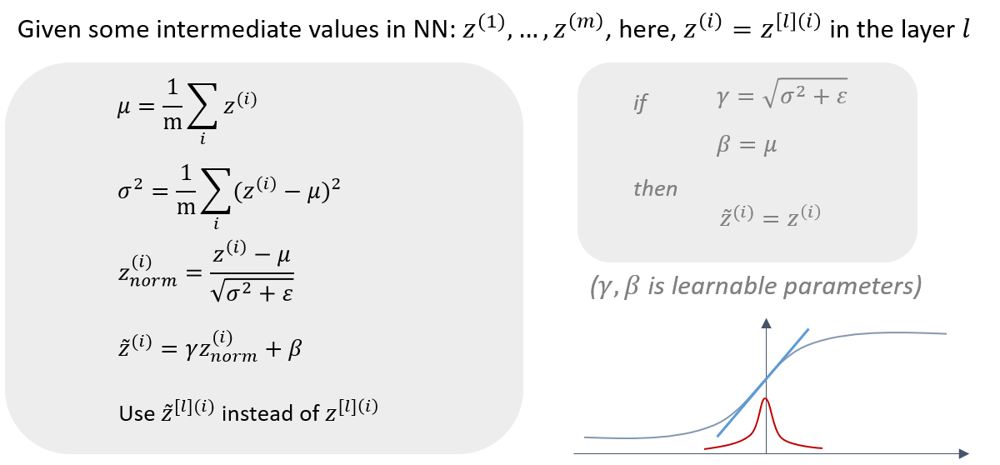

_Notes_<br>
- Use `z_tilde[l][i]` instead of `z[l][i]` for the later computations in the NN. 
- `ε` is added in the square root for numerical stability (in case `σ^2` is zero in some estimate).
- If `𝛾 = sqrt(variance + epsilon)` and `𝛽 = mean` then `z_tilde[i] = z[i]`.


- In the rise of deep learning, one of the most important ideas has been an algorithm called **batch normalization**, created by two researchers, Sergey Ioffe and Christian Szegedy.
- Batch Normalization speeds up learning.
- Before we normalized input by subtracting the mean and dividing by variance. This helped a lot for the shape of the cost function and for reaching the minimum point faster.
- The question is: *for any hidden layer can we normalize `A[l]` to train `W[l+1]`, `b[l+1]` faster?* This is what batch normalization is about.
- There are some debates in the deep learning literature about whether you should normalize values before the activation function `Z[l]` or after applying the activation function `A[l]`. In practice, normalizing `Z[l]` is done much more often and that is what Andrew Ng presents.
- Algorithm:
  - Given `Z[l] = [z(1), ..., z(m)]`, i = 1 to m (for each input)
  - Compute `mean = 1/m * sum(z[i])`
  - Compute `variance = 1/m * sum((z[i] - mean)^2)`
  - Then `Z_norm[i] = (z[i] - mean) / np.sqrt(variance + epsilon)` (add `epsilon` for numerical stability if variance = 0)
    - Forcing the inputs to a distribution with zero mean and variance of 1.
  - Then `Z_tilde[i] = gamma * Z_norm[i] + beta`
    - To make inputs belong to other distribution (with other mean and variance).
    - gamma and beta are learnable parameters of the model.
    - Making the NN learn the distribution of the outputs.
    - _Note:_ if `gamma = sqrt(variance + epsilon)` and `beta = mean` then `Z_tilde[i] = z[i]`


#### Fitting Batch Norm into a neural network

- `𝛽[1],𝛾[1],𝛽[2],𝛾[2],⋯,𝛽[𝐿],𝛾[𝐿]` can also be updated using gradient descent with momentum (or RMSprop, Adam). `𝛽[l],𝛾[l]` have the shape with `z[l]`.
- Similar computation can also be applied to mini-batches.
- With batch normalization, the parameter `b[l]` can be eliminated. So `w[l],𝛽[l],𝛾[l]` need to be trained.
- The parameter `𝛽` here has nothing to do with the `beta` in the momentum, RMSprop or Adam algorithms.

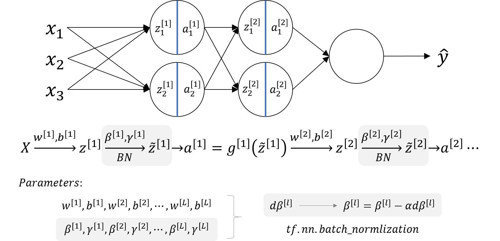


- Using batch norm in 3 hidden layers NN:
    
- Our NN parameters will be:
  - `W[1]`, `b[1]`, ..., `W[L]`, `b[L]`, `beta[1]`, `gamma[1]`, ..., `beta[L]`, `gamma[L]`
  - `beta[1]`, `gamma[1]`, ..., `beta[L]`, `gamma[L]` are updated using any optimization algorithms (like GD, RMSprop, Adam)
- If you are using a deep learning framework, you won't have to implement batch norm yourself:
  - Ex. in Tensorflow you can add this line: `tf.nn.batch-normalization()`
- Batch normalization is usually applied with mini-batches.
- If we are using batch normalization parameters `b[1]`, ..., `b[L]` doesn't count because they will be eliminated after mean subtraction step, so:
  ```
  Z[l] = W[l]A[l-1] + b[l] => Z[l] = W[l]A[l-1]
  Z_norm[l] = ...
  Z_tilde[l] = gamma[l] * Z_norm[l] + beta[l]
  ```
  - Taking the mean of a constant `b[l]` will eliminate the `b[l]`
- So if you are using batch normalization, you can remove b[l] or make it always zero.
- So the parameters will be `W[l]`, `beta[l]`, and `alpha[l]`.
- Shapes:
  - `Z[l]       - (n[l], m)`
  - `beta[l]    - (n[l], m)`
  - `gamma[l]   - (n[l], m)`


#### Why does Batch Norm work

- By normalizing all the features, input features `X`, to take on a similar range of values that can speed up learning. So batch normalization is doing a similar thing.
- To avoid *covariate shift* of data distribution, which makes the parameters change a lot in the training progress. Batch norm can reduce the amount that the distribution of the hidden unit values shifts around by making the mean and variance of `z` values remain the same. 
  - It allows each layer of the network to learn by itself, a little bit more independently of other layers, and this has the effect of speedup of learning in the whole network.
  - From the perspective of one of the later layers of the neural network, the earlier layers don't get to shift around as much, because they're constrained to have the same mean and variance. This makes the job of learning on the later layers easier.
- It has a slight regularization effect.
  - The mean and variance is a little bit noisy because it's estimated with just a relatively small sample of data (each mini-batch). So similar to dropout, it adds some noise to each hidden layer's activations. 
  - It's forcing the downstream hidden units not to rely too much on any one hidden unit.
  - The noise added is quite small, so not a huge regularization effect. You can use batch norm together with dropouts if you want the more powerful regularization effect of dropout.
  - Using bigger mini-batch size can reduce noise and therefore reduce regularization effect.
  - Don't turn to batch norm as a regularization. This is not the intent of batch norm.
  - Just use it as a way to normalize hidden units activations and therefore speedup learning.
- At test time, you try to make predictors and evaluate the neural network, you might not have a mini-batch of examples, you might be processing one single example at the time. So, at test time you need to do something slightly differently to make sure your predictions make sense.


- The first reason is the same reason as why we normalize X.
- The second reason is that batch normalization reduces the problem of input values changing (shifting).
- Batch normalization does some regularization:
  - Each mini batch is scaled by the mean/variance computed of that mini-batch.
  - This adds some noise to the values `Z[l]` within that mini batch. So similar to dropout it adds some noise to each hidden layer's activations.
  - This has a slight regularization effect.
  - Using bigger size of the mini-batch you are reducing noise and therefore regularization effect.
  - Don't rely on batch normalization as a regularization. It's intended for normalization of hidden units, activations and therefore speeding up learning. For regularization use other regularization techniques (L2 or dropout).


#### Batch Norm at test time

- Batch norm processes our data one mini batch at a time, but at test time we need to process examples one at a time.
- In theory we could run the whole training set through final network to get `𝜇` and `𝜎^2`.
- In practice, usually implement an exponentially weighted average where we just keep track of the `𝜇` and `𝜎^2` we're seeing during training and use an EWA (across mini-batches), also sometimes called the running average, to get a rough estimate of `𝜇` and `𝜎^2` and then use these to scale at test time.
  - `𝜇{1}[l], 𝜇{2}[l], 𝜇{3}[l], ...` —> `𝜇[l]`
  - `𝜎^2{1}[l], 𝜎^2{2}[l], 𝜎^2{3}[l], ...` —> `𝜎^2[l]`


- When we train a NN with Batch normalization, we compute the mean and the variance of the mini-batch.
- In testing we might need to process examples one at a time. The mean and the variance of one example won't make sense.
- We have to compute an estimated value of mean and variance to use it in testing time.
- We can use the weighted average across the mini-batches.
- We will use the estimated values of the mean and variance to test.
- This method is also sometimes called "Running average".
- In practice most often you will use a deep learning framework and it will contain some default implementation of doing such a thing.


### Multi-class classification

#### Softmax Regression

- In every example we have used so far we were talking about binary classification. 
  - There is a generalization of logistic regression called Softmax regression that is used for multiclass classification.

_Notation_<br>
- `C` = no. of classes; Range: (0, ..., C-1)
- Each of `C` values in the output layer will contain a probability of the example to belong to each of the classes. (they sum up to 1)
- In the last layer we will have to activate the softmax activation function instead of the sigmoid activation.

_Softmax activation equations_<br>
```
t = e^(Z[L])              # shape(C, m)
A[L] = e^(Z[L]) / sum(t)  # shape(C, m), sum(t) - sum of t's for each example (shape (1, m))
```
Use softmax activation function.

```python
def softmax(z):
    return np.exp(z) / sum(np.exp(z))

z = [1,0.5,-2,1,3]
print(softmax(z)) 
# array([0.09954831, 0.0603791 , 0.00495622, 0.09954831, 0.73556806])
```

The name softmax comes from contrasting it to what's called a hard max which would have taken the vector
Z and matched it to a vector. So hard max function will look at the elements of Z and just put a 1 in the position
of the biggest element of Z and then 0s everywhere else. And so this is a very hard max where the biggest
element gets a output of 1 and everything else gets an output of 0. Whereas in contrast, a softmax is a more
gentle mapping from Z to these probabilities. Softmax regression generalizes logistic regression to C classes. or
we can say softmax regression is a generalization of logistic regression to more than two classes.


- In every example we have used so far we were talking about binary classification.
- There are a generalization of logistic regression called Softmax regression that is used for multiclass classification/regression.
- For example if we are classifying by classes `dog`, `cat`, `baby chick` and `none of that`
  - Dog `class = 1`
  - Cat `class = 2`
  - Baby chick `class = 3`
  - None `class = 0`
  - To represent a dog vector `y = [0 1 0 0]`
  - To represent a cat vector `y = [0 0 1 0]`
  - To represent a baby chick vector `y = [0 0 0 1]`
  - To represent a none vector `y = [1 0 0 0]`
- Notations:
  - `C = no. of classes`
  - Range of classes is `(0, ..., C-1)`
  - In output layer `Ny = C`
- Each of C values in the output layer will contain a probability of the example to belong to each of the classes.
- In the last layer we will have to activate the Softmax activation function instead of the sigmoid activation.
- Softmax activation equations:
  ```
  t = e^(Z[L])                      # shape(C, m)
  A[L] = e^(Z[L]) / sum(t)          # shape(C, m), sum(t) - sum of t's for each example (shape (1, m))
  ```


#### Training a softmax classifier

Softmax regression is a generalization of logistic regression to more than two classes.


- There's an activation which is called hard max, which gets 1 for the maximum value and zeros for the others.
  - If you are using NumPy, its `np.max` over the vertical axis.
- The Softmax name came from softening the values and not harding them like hard max.
- Softmax is a generalization of logistic activation function to `C` classes. If `C = 2` softmax reduces to logistic regression.
- The loss function used with softmax:
  ```
  L(y, y_hat) = - sum(y[j] * log(y_hat[j])) # j = 0 to C-1
  ```
- The cost function used with softmax:
  ```
  J(w[1], b[1], ...) = - 1 / m * (sum(L(y[i], y_hat[i]))) # i = 0 to m
  ```
- Back propagation with softmax:
  ```
  dZ[L] = Y_hat - Y
  ```
- The derivative of softmax is:
  ```
  Y_hat * (1 - Y_hat)
  ```
- Example:
    


### Introduction to programming frameworks

#### Deep learning frameworks

- Caffe/Caffe2
- CNTK
- DL4J
- Keras
- Lasagne
- mxnet
- PaddlePaddle
- TensorFlow
- Theano
- Torch

*Choosing deep learning frameworks*:

- Ease of programming (development and deployment)
- Running speed
- Truly open (open source with good governance)


- It's not practical to implement everything from scratch. Our numpy implementations were to know how NN works.
- There are many good deep learning frameworks.
- Deep learning is now in the phase of doing something with the frameworks and not from scratch to keep on going.
- Here are some of the leading deep learning frameworks:
  - Caffe/ Caffe2
  - CNTK
  - DL4j
  - Keras
  - Lasagne
  - mxnet
  - PaddlePaddle
  - TensorFlow
  - Theano
  - Torch/Pytorch
- These frameworks are getting better month by month. Comparison between them can be found [here](https://en.wikipedia.org/wiki/Comparison_of_deep_learning_software).
- How to choose deep learning framework:
  - Ease of programming (development and deployment)
  - Running speed
  - Truly open (open source with good governance)
- Programming frameworks can not only shorten your coding time but sometimes also perform optimizations that speed up your code.


#### Tensorflow

- The two main object classes in tensorflow are *Tensors* and *Operators*.
- When we code in tensorflow we have to take the following steps:
  - Create a graph containing Tensors (*Variables*, *Placeholders* ...) and *Operations* (`tf.matmul`, `tf.add`, ...)
  - Create a *session*
  - Initialize the *session*
  - Run the *session* to execute the graph
- We might need to execute the graph multiple times when implementing `model()`
- The backpropagation and optimization is automatically done when running the session on the "optimizer" object.

```python
import numpy as np 
import tensorflow as tf

coefficients = np.array([[1], [-20], [25]])
w = tf.Variable([0],dtype=tf.float32)
x = tf.placeholder(tf.float32, [3,1])
cost = x[0][0]*w**2 + x[1][0]*w + x[2][0]    # (w-5)**2
train = tf.train.GradientDescentOptimizer(0.01).minimize(cost)
init = tf.global_variables_initializer()
session = tf.Session()
session.run(init) 
print(session.run(w))

for i in range(1000):
  session.run(train, feed_dict={x:coefficients})
print(session.run(w))
```


- In this section we will learn the basic structure of TensorFlow programs.
- Lets see how to implement a minimization function:
  - Example function: `J(w) = w^2 - 10w + 25`
  - The result should be `w = 5` as the function is `(w-5)^2 = 0`
  - Code v.1:
    ```python
    import numpy as np
    import tensorflow as tf
    
    
    w = tf.Variable(0, dtype=tf.float32)                 # creating a variable w
    cost = tf.add(tf.add(w**2, tf.multiply(-10.0, w)), 25.0)        # can be written as this - cost = w**2 - 10*w + 25
    train = tf.train.GradientDescentOptimizer(0.01).minimize(cost)

    init = tf.global_variables_initializer()
    session = tf.Session()
    session.run(init)
    session.run(w)    # Runs the definition of w, if you print this it will print zero
    session.run(train)

    print("W after one iteration:", session.run(w))

    for i in range(1000):
    	session.run(train)

    print("W after 1000 iterations:", session.run(w))
    ```
  - Code v.2 (we feed the inputs to the algorithm through coefficients):

    ```python
    import numpy as np
    import tensorflow as tf
    
    
    coefficients = np.array([[1.], [-10.], [25.]])

    x = tf.placeholder(tf.float32, [3, 1])
    w = tf.Variable(0, dtype=tf.float32)                 # Creating a variable w
    cost = x[0][0]*w**2 + x[1][0]*w + x[2][0]

    train = tf.train.GradientDescentOptimizer(0.01).minimize(cost)

    init = tf.global_variables_initializer()
    session = tf.Session()
    session.run(init)
    session.run(w)    # Runs the definition of w, if you print this it will print zero
    session.run(train, feed_dict={x: coefficients})

    print("W after one iteration:", session.run(w))

    for i in range(1000):
    	session.run(train, feed_dict={x: coefficients})

    print("W after 1000 iterations:", session.run(w))
    ```
- In TensorFlow you implement only the forward propagation and TensorFlow will do the backpropagation by itself.
- In TensorFlow a placeholder is a variable you can assign a value to later.
- If you are using a mini-batch training you should change the `feed_dict={x: coefficients}` to the current mini-batch data.
- Almost all TensorFlow programs use this:
  ```python
  with tf.Session() as session:       # better for cleaning up in case of error/exception
  	session.run(init)
  	session.run(w)
  ```
- In deep learning frameworks there are a lot of things that you can do with one line of code like changing the optimizer.
_**Side notes:**_
- Writing and running programs in TensorFlow has the following steps:
  1. Create Tensors (variables) that are not yet executed/evaluated.
  2. Write operations between those Tensors.
  3. Initialize your Tensors.
  4. Create a Session.
  5. Run the Session. This will run the operations you'd written above.
- Instead of needing to write code to compute the cost function we know, we can use this line in TensorFlow :
  `tf.nn.sigmoid_cross_entropy_with_logits(logits = ...,  labels = ...)`
- To initialize weights in NN using TensorFlow use:
  ```
  W1 = tf.get_variable("W1", [25,12288], initializer = tf.contrib.layers.xavier_initializer(seed = 1))

  b1 = tf.get_variable("b1", [25,1], initializer = tf.zeros_initializer())
  ```
- For 3-layer NN, it is important to note that the forward propagation stops at `Z3`. The reason is that in TensorFlow the last linear layer output is given as input to the function computing the loss. Therefore, you don't need `A3`!
- To reset the graph use `tf.reset_default_graph()`


## Extra Notes

- If you want a good papers in deep learning look at the ICLR proceedings (Or NIPS proceedings) and that will give you a really good view of the field.
- Who is Yuanqing Lin?
  - Head of Baidu research.
  - First one to win ImageNet
  - Works in PaddlePaddle deep learning platform.


[CS230-blog]: https://cs230.stanford.edu/blog/split/

[bias-variance-tradeoff]: http://scott.fortmann-roe.com/docs/BiasVariance.html

[normalizing]: https://stackoverflow.com/questions/4674623/why-do-we-have-to-normalize-the-input-for-an-artificial-neural-network

[gradient-descent-ewa]: http://people.duke.edu/~ccc14/sta-663-2018/notebooks/S09G_Gradient_Descent_Optimization.html

[gradient-descent-momentum-ewa]: https://stats.stackexchange.com/questions/353833/why-is-gradient-descent-with-momentum-considered-an-exponentially-weighted-avera

[e-folding]: https://en.formulasearchengine.com/wiki/E-folding

[adam]: https://arxiv.org/abs/1412.6980

---
Notes by Aaron © 2020
