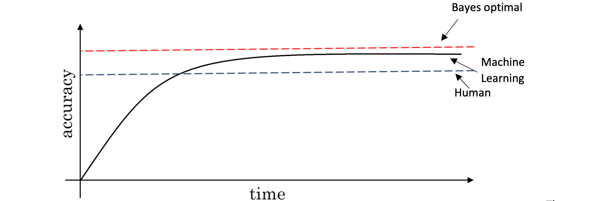
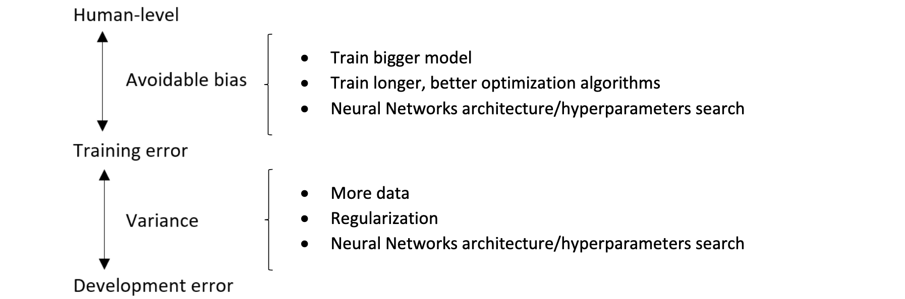
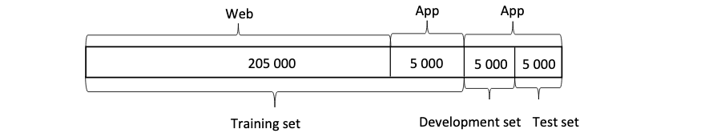
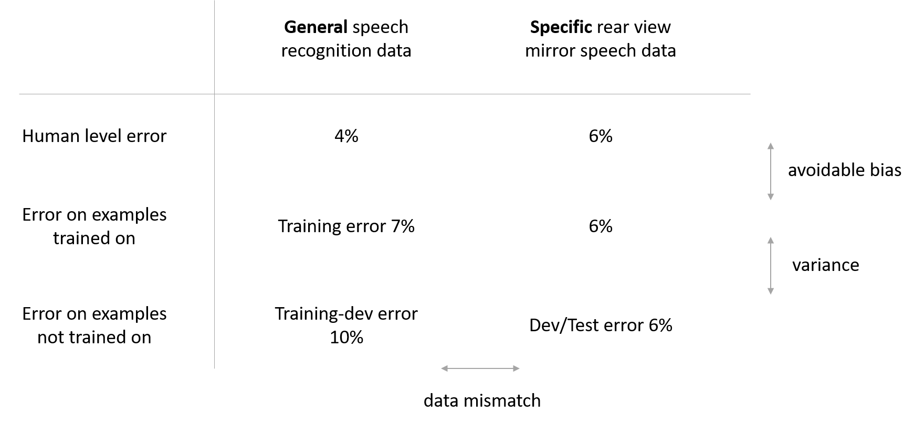
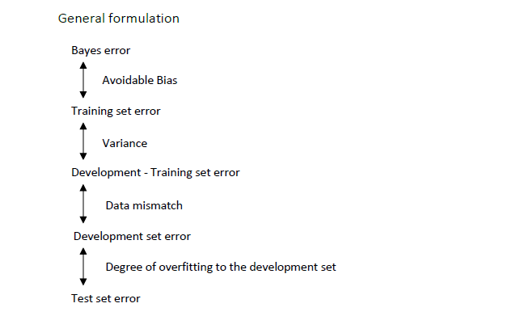
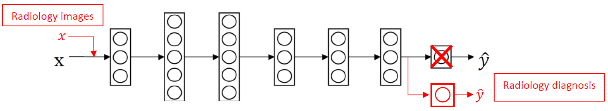
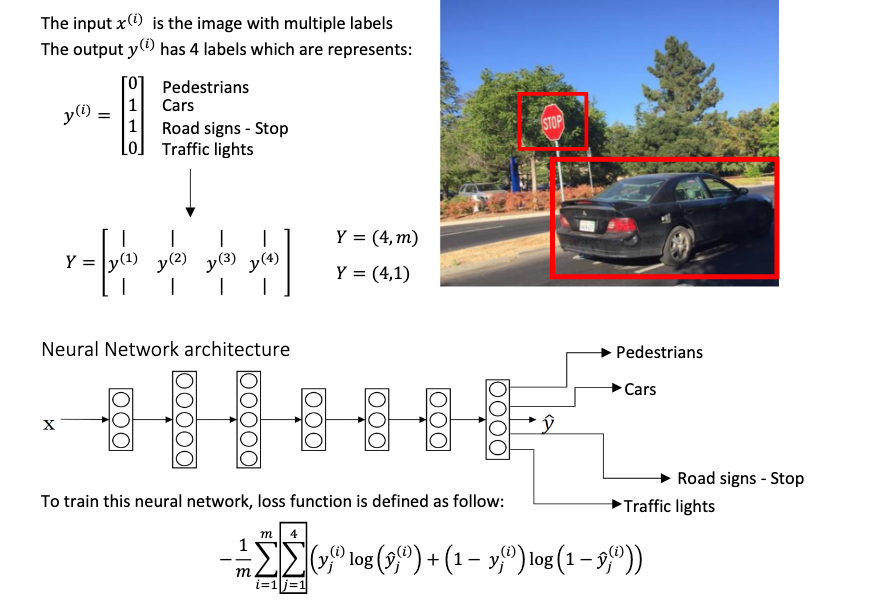
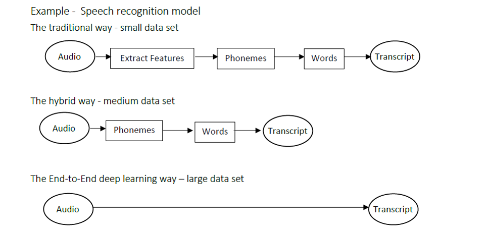

# Course 3: Structuring Machine Learning Projects

Also from ML Yearning (TODO: add link)

- [Course 3: Structuring Machine Learning Projects](#course-3-structuring-machine-learning-projects)
  - [Week 1: ML Strategy (1)](#week-1-ml-strategy-1)
    - [Learning Objectives](#learning-objectives)
    - [Introduction to ML Strategy](#introduction-to-ml-strategy)
      - [Why ML Strategy](#why-ml-strategy)
      - [Orthogonalization](#orthogonalization)
    - [Setting up your goal](#setting-up-your-goal)
      - [Single number evaluation metric](#single-number-evaluation-metric)
      - [Satisficing and optimizing metric](#satisficing-and-optimizing-metric)
      - [Train/dev/test distributions](#traindevtest-distributions)
      - [Size of the dev and test sets](#size-of-the-dev-and-test-sets)
      - [When to change dev/test sets and metrics](#when-to-change-devtest-sets-and-metrics)
    - [Comparing to human-level performance](#comparing-to-human-level-performance)
      - [Why human-level performance](#why-human-level-performance)
      - [Avoidable bias](#avoidable-bias)
      - [Understanding human-level performance](#understanding-human-level-performance)
      - [Surpassing human-level performance](#surpassing-human-level-performance)
      - [Improving your model performance](#improving-your-model-performance)
  - [Week 2: ML Strategy (2)](#week-2-ml-strategy-2)
    - [Learning Objectives](#learning-objectives-1)
    - [Error Analysis](#error-analysis)
      - [Carrying out error analysis](#carrying-out-error-analysis)
      - [Cleaning up incorrectly labeled data](#cleaning-up-incorrectly-labeled-data)
      - [Build your first system quickly, then iterate](#build-your-first-system-quickly-then-iterate)
    - [Mismatched training and dev/test set](#mismatched-training-and-devtest-set)
      - [Training and testing on different distributions](#training-and-testing-on-different-distributions)
      - [Bias and Variance with mismatched data distributions](#bias-and-variance-with-mismatched-data-distributions)
      - [Addressing data mismatch](#addressing-data-mismatch)
    - [Learning from multiple tasks](#learning-from-multiple-tasks)
      - [Transfering learning](#transfering-learning)
      - [Multi-task learning](#multi-task-learning)
    - [End-to-end deep learning](#end-to-end-deep-learning)
      - [What is end-to-end deep learning](#what-is-end-to-end-deep-learning)
      - [Whether to use end-to-end deep learning](#whether-to-use-end-to-end-deep-learning)

## Week 1: ML Strategy (1)

### Learning Objectives

- Explain why Machine Learning strategy is important
- Apply satisficing and optimizing metrics to set up your goal for ML projects
- Choose a correct train/dev/test split of your dataset
- Define human-level performance
- Use human-level performance to define key priorities in ML projects
- Take the correct ML Strategic decision based on observations of performances and dataset

### Introduction to ML Strategy

#### Why ML Strategy

*Ideas to improve a machine learning system*:

- Collect more data
- Collect more diverse training set 
  - e.g., pics in unusual positions, unusual coloration, shot with a variety of camera settings
- Train algorithm longer with gradient descent
- Try Adam instead of gradient descent
- Try bigger network,  with more layers/hidden units/parameters.
- Try smaller network
- Try dropout
- Add L2 regularization
- Network architecture
  - Activation functions
  - number of hidden units
  - ...

In order to have quick and effective ways to figure out which of all of these ideas and maybe even other ideas, are worth pursuing and which ones we can safely discard, we need ML strategies.

#### Scale drives machine learning progress (additional)

Many of the ideas of deep learning (neural networks) have been around for decades. Why are these ideas taking off now?

Two of the biggest drivers of recent progress have been:
• **Data availability**.​ People are now spending more time on digital devices, which generate huge amounts of data that we can feed to our learning algorithms.
• **Computational scale**. ​We started just a few years ago to be able to train NN that are big enough to take advantage of the huge datasets we now have.

- In detail, even as you accumulate more data, usually the performance of older learning algorithms, such as logistic regression, “plateaus.” This means its learning curve “flattens out,” and the algorithm stops improving even as you give it more data.
- It was as if the older algorithms didn’t know what to do with all the data we now have. If you train a small neutral network (NN) on the same supervised learning task, you might get slightly better performance.
  - Here, by “Small NN” we mean a neural network with only a small number of hidden units/layers/parameters. 
- Finally, if you train larger and larger neural networks, you can obtain even better performance


Thus, you obtain the best performance when you (i) Train a very large neural network, so that you are on the green curve above; (ii) Have a huge amount of data.

Many other details such as neural network architecture are also important, and there has been much innovation here. But one of the more reliable ways to improve an algorithm’s
performance today is still to (i) train a bigger network and (ii) get more data.

#### Orthogonalization

_Motivation examples_<br>
In the example of TV tuning knobs, orthogonalization refers to that the TV designers had designed the knobs so that each knob kind of does only one thing.

In a car the stearing wheel controls the angle and the accelerator and brake control the speed. If there are two controllers, each has different effect simultaneously on angle and speed, then it's much harder to set the car to the speed and angle we want.

```python
0.3 * angle - 0.8 * speed
2 * angle + 0.9 * speed
```

Orthogonal means at 90 degrees to each other. By having orthogonal controls that are ideally aligned with the things we actually want to control. It makes it much easier to tune the knobs we have to tune. To tune the steering wheel angle, and the accelerator, the brake, to get the car to do what we want.

- Some deep learning developers know exactly what hyperparameter to tune in order to try to achieve one effect. This is a process we call orthogonalization.
- In orthogonalization, you have some controls, but each control does a specific task and doesn't affect other controls.

For a supervised learning system to do well, you usually need to tune the knobs of your system to make sure that four things hold true:

| chain of assumptions in ML | tune the *knobs* |
| :---- | :---- |
| Fit training set well on cost function (near human level performance if possible) | bigger network<br>better optimization algorithm, Adam... |
| Fit dev set well on cost function | regularization<br>bigger training set |
| Fit test set well on cost function | bigger dev set |
| Performs well in real world | change dev set or cost function<br>(dev test set distribution not correct or cost function not right) |

Early stopping, though not a bad technique, is a *knob* that simultaneously affects the training set and dev set performance, and therefore is **less orthogonalized**, so Andrew tend not to use it.

### Setting up your goal

#### Single number evaluation metric

Evaluation metric allows you to quickly tell if classifier A or classifier B is better, and therefore having a dev set plus single number evaluation metric tends to speed up iterating.

| metric | calculation | definition |
| :----: | :----: | :---- |
| Precision | `P = TP/(TP+FP)` | percentage of true positive in predicted positive |
| Recall | `R = TP/(TP+FN)` | percentage of true positive predicted in all real positive |
| F1 score | `F1 = 2PR/(P+R)` or `1/F1 = (1/P+1/R)/2` | harmonic mean of precision and recall |

Classification accuracy is an example of a ​single-number evaluation metric​: You run your classifier on the dev set (or test set), and get back a single number about what fraction
of examples it classified correctly. According to this metric, if classifier A obtains 97% accuracy, and classifier B obtains 90% accuracy, then we judge classifier A to be superior.

In contrast, Precision and Recall is not a single-number evaluation metric: It gives two numbers for assessing your classifier. Having multiple-number evaluation metrics makes it
harder to compare algorithms. Suppose your algorithms perform as follows:

| Classifier | Precision | Recall | F1 score |
| :----: | :----: | :---- | :---- |
| A | 95% | 90% | 92.4% |
| B | 95% | 85% | 91.0% |

- Here, neither classifier is obviously superior, so it doesn’t immediately guide you toward picking one.

During development, your team will try a lot of ideas about algorithm architecture, model parameters, choice of features, etc. Having a ​single-number evaluation metric​ such as accuracy allows you to sort all your models according to their performance on this metric, and quickly decide what is working best.

If you really care about both Precision and Recall, I recommend using one of the standard ways to combine them into a single number. For example, one could take the average of
precision and recall, to end up with a single number. Alternatively, you can compute the `F1 score`, which combines them.

Having a single-number evaluation metric speeds up your ability to make a decision when you are selecting among a large number of classifiers. It gives a clear preference ranking
among all of them, and therefore a clear direction for progress.

As a final example, suppose you are separately tracking the accuracy of your cat classifier in four key markets: (i) US, (ii) China, (iii) India, and (iv) Other. This gives four metrics. By taking an average or weighted average of these four numbers, you end up with a single number metric. Taking an average or weighted average is one of the most common ways to combine multiple metrics into one.

#### Satisficing and optimizing metric

Way to combine multiple evaluation metrics.

| Classifier | Accuracy | Running Time |
| :----: | :----: | :---- |
| A | 90% | 80ms |
| B | 92% | 95ms |
| C | 95% | 1,500ms |

If we care about the classification accuracy of our cat's classifier and also care about the running time or some other performance, instead of combining them into an overall evaluation metric by their *artificial* linear weighted sum (`Accuracy - 0.5*RunningTime`), we actually can have one thing as an **optimizing metric** and the others as **satisficing metrics**.

- In the cat's classifier example, we might have accuracy as optimizing metric and running time as satificing metric.
  - First, define what is an “acceptable” running time (e.g., 100ms). Then, maximize accuracy, subject to your classifier meeting the running time criteria.
- In wake words detection system (like Amazon Echo, Apple Siri, ...), maybe accuracy is an optimizing metric and false positive `≤ 1` every 24 hours is a satificing metric.
- If you are trading off `N` different criteria, such as binary file size of the model (which is important for mobile apps, since users don’t want to download large apps), running time, and accuracy, you might consider setting `N-1` of the criteria as “satisficing” metrics, i.e., you simply require that they meet a certain value. Then define the final one as the “optimizing” metric.
  - e.g., set a threshold for what is acceptable for binary file size and running time, and try to optimize accuracy given those constraints.

Once your team is aligned on the evaluation metric to optimize, they will be able to make faster progress.

#### Train/dev/test distributions

*Guideline*:

- Choose a dev set and test set to reflect data you expect to get in future and consider important to do well on.
- In particular, **the dev set and the test set here, should come from the same distribution**.
- Setting up the dev set, as well as the validation metric is really defining what target you want to aim at.

*Example*:

You have your cat app image data segmented into four regions, based on your largest markets: (i) US, (ii) China, (iii) India, and (iv) Other. To come up with a dev set and a test
set, say we put US and India in the dev set; China and Other in the test set. In other words, we can randomly assign two of these segments to the dev set, and the other two to the test set, right? **Wrong**

Once you define the dev and test sets, your team will be focused on improving dev set performance. Thus, the dev set should reflect the task you want to improve on the most: To
do well on all four geographies, and not only two.

There is a second problem with having different dev and test set distributions: There is a chance that your team will build something that works well on the dev set, only to find that it does poorly on the test set. I’ve seen this result in much frustration and wasted effort. Avoid letting this happen to you.

As an example, suppose your team develops a system that works well on the dev set but not the test set. If your dev and test sets had come from the same distribution, then you would
have a very clear diagnosis of what went wrong: You have overfit the dev set. The obvious cure is to get more dev set data.

But if the dev and test sets come from different distributions, then your options are less clear. Several things could have gone wrong:
1. You had overfit to the dev set.
2. The test set is harder than the dev set. So your algorithm might be doing as well as could be expected, and no further significant improvement is possible.
3. The test set is not necessarily harder, but just different, from the dev set. So what works well on the dev set just does not work well on the test set. In this case, a lot of your work to improve dev set performance might be wasted effort.

Working on machine learning applications is hard enough. Having mismatched dev and test sets introduces additional uncertainty about whether improving on the dev set distribution
also improves test set performance. **Having mismatched dev and test sets makes it harder to figure out what is and isn’t working, and thus makes it harder to prioritize what to work on.**

If you are working on a 3rd party benchmark problem, their creator might have specified dev and test sets that come from different distributions. Luck, rather than skill, will have a
greater impact on your performance on such benchmarks compared to if the dev and test sets come from the same distribution. It is an important research problem to develop
learning algorithms that are trained on one distribution and generalize well to another. But if your goal is to make progress on a specific machine learning application rather than make research progress, I recommend trying to choose dev and test sets that are drawn from the same distribution. This will make your team more efficient.

#### Size of the dev and test sets

- In the era of big data, the old rule of thumb of a 70/30 (or 60/20/20) is that, that no longer applies (it is valid for a number of examples ~ <100000). And the trend has been to use more data for training and less for dev and test, especially when you have a very large data sets.
- Suppose we have a million training examples, it might be quite reasonable to set up the data so that we have 98% in the training set, 1% dev, and 1% test.
- The guideline is, to set your test set to big enough to give high confidence in the overall performance of your system.
- When people were talking about using train test splits, what they actually had was a train dev split and no test set.
- In the history of machine learning, not everyone has been completely clean and completely records of about calling the dev set when it really should be treated as dev set.

*Example*:

The dev set should be large enough to detect differences between algorithms that you are trying out. For example, if classifier A has an accuracy of 90.0% and classifier B has an
accuracy of 90.1%, then a dev set of 100 examples would not be able to detect this 0.1% difference. Compared to other machine learning problems I’ve seen, a 100 example dev set is
small. Dev sets with sizes from 1,000 to 10,000 examples are common. With 10,000 examples, you will have a good chance of detecting an improvement of 0.1%.2

For mature and important applications—for example, advertising, web search, and product recommendations—I have also seen teams that are highly motivated to eke out even a 0.01%
improvement, since it has a direct impact on the company’s profits. In this case, the dev set could be much larger than 10,000, in order to detect even smaller improvements.

How about the size of the test set? It should be large enough to give high confidence in the overall performance of your system. One popular heuristic had been to use 30% of your data
for your test set. This works well when you have a modest number of examples—say 100 to 10,000 examples. But in the era of big data where we now have machine learning problems
with sometimes more than a billion examples, the fraction of data allocated to dev/test sets has been shrinking, even as the absolute number of examples in the dev/test sets has been
growing. There is no need to have excessively large dev/test sets beyond what is needed to evaluate the performance of your algorithms.

#### When to change dev/test sets and metrics

In an example of cat classification system, classification error might not be a reasonable metric if two algorithms have the following performance:

| algorithm | classification error | issues | review |
| :----: | :----: | :---- | :---- |
| Algorithm A | 3% | letting through lots of porn images | showing pornographic images to users is intolerable |
| Algorithm B | 5% | no pornographic images | classifies fewer images but acceptable |

In this case, metric should be modified (the best algorithm by metric is A, but the users would decide B). One way to change this evaluation metric would be adding weight terms.

| metric | calculation | notation |
| :----: | :----: | :----: |
| classification error |  | `L` can be identity function to count correct labels |
| weighted classification error |  |  |

So if you find that evaluation metric is not giving the correct rank order preference for what is actually better algorithm, then there's a time to think about defining a new evaluation metric.

This is actually an example of an orthogonalization where I think you should take a machine learning problem and break it into distinct steps.

- First, figure out how to define a metric that captures what you want to do. (*place the target*)
- Second, think about how to actually do well on this metric. (*shoot the target*)

The overall guideline is if your current metric and data you are evaluating on doesn't correspond to doing well on what you actually care about, then change your metrics and/or your dev/test set to better capture what you need your algorithm to actually do well on.

### Comparing to human-level performance

#### Why human-level performance

A lot more machine learning teams have been talking about comparing the machine learning systems to human-level performance.

- First, because of advances in deep learning, machine learning algorithms are suddenly working much better and so it has become much more feasible in a lot of application areas for machine learning algorithms to actually become competitive with human-level performance.
- Second, the workflow of designing and building a machine learning system is much more efficient when we're trying to do something that humans can also do.

The graph below shows the performance of humans and machine learning over time.



Machine learning progresses slowly when it surpasses human-level performance. One of the reason is that human-level performance can be closeto Bayes optimal error, especially for natural perception problem.

**Bayes optimal error** is defined as the best possible error. In other words, it means that any functions mapping from x to y can’t surpass a certain level of accuracy.

Also, when the performance of machine learning is worse than the performance of humans, we can improve it with different tools. They are harder to use once it surpasses human-level performance.

*These tools are*:

- Get labelled data from humans
- Gain insight from manual error analysis: Why did a person get this right?
- Better analysis of bias/variance.

#### Avoidable bias

By knowing what the human-level performance is, it is possible to tell when a training set is performing well or not.

| performance | Scenario A | Scenario B |
| :----: | :----: | :----: |
| humans | 1 | 7.5 |
| training error | 8 | 8 |
| development error | 10 | 10 |

In this case, we use the human-level error as a proxy for Bayes error since humans are good to identify images. If you want to improve the performance of the training set but you can’t do better than the Bayes error otherwise the training set is overfitting. By knowing the Bayes error, it is easier to focus on whether bias or variance avoidance tactics will improve the performance of the model.

- *Scenario A*: There is a 7% gap between the performance of the training set and the human-level error. It means that the algorithm isn’t fitting well with the training set since the target is around 1%. To resolve the issue, we use bias reduction technique such as training a bigger neural network or running the training set longer.

- *Scenario B*: The training set is doing good since there is only a 0.5% difference with the human-level error. The difference between the training set and the human-level error is called **avoidable bias**. The focus here is to reduce the variance since the difference between the training error and the development error is 2%. To resolve the issue, we use variance reduction technique such as regularization or have a bigger training set.

_formulas_<br>
- Avoidable bias = Training error - Human (Bayes) error
- Variance = Dev error - Training error


#### Understanding human-level performance

Summary of bias/variance with human-level performance:

- When choosing human-level performance, it has to be chosen in the terms of what you want to achieve with the system.
  - e.g., you might have multiple human-level performances based on the human experience. Then you choose the human-level performance (proxy for Bayes error) that is more suitable for the system you're trying to build.
- Human-level error is a proxy for Bayes error.
  - `avoidable bias = training error - human-level error`
  - `variance = dev error - training error`
- If the difference between human-level error and the training error (avoidable bias) is bigger than the difference between the training error and the development error. The focus should be on bias reduction technique.
- If the difference between training error and the development error is bigger than the difference between the human-level error and the training error, the focus should be on variance reduction technique

So having an estimate of human-level performance gives you an estimate of Bayes error. And this allows you to more quickly make decisions as to whether you should focus on trying to reduce a bias or trying to reduce the variance of your algorithm.

These techniques will tend to work well until you surpass human-level performance, whereupon you might no longer have a good estimate of Bayes error that still helps you make this decision really clearly.

#### Surpassing human-level performance

*Classification task performance (classification error)*:

| performance | Scenario A | Scenario B |
| :----: | :----: | :----: |
| Team of humans | 0.5 | 0.5 |
| One human | 1.0 | 1 |
| Training error | 0.6 | 0.3 |
| Development error | 0.8 | 0.4 |

- Scenario A: In this case, the Bayes error is 0.5%, therefore the available bias is 0.1%et the variance is 0.2%.
- Scenario B: In this case, there is not enough information to know if bias reduction or variance reduction has to be done on the algorithm. It doesn’t mean that the model cannot be improve, it means that the conventional ways to know if bias reduction or variance reduction are not working in this case.

There are many problems where machine learning significantly surpasses human-level performance, especially with structured data:

| problem | structured data |
| :---- | :---- |
| Online advertising | database of what has users clicked on |
| Product recommendations | database of proper support for |
| Logistics (predicting transit time) | database of how long it takes to get from A to B |
| Loan approvals | database of previous loan applications and their outcomes |

And these are not **natural perception problems**, so these are not *computer vision*, or *speech recognition*, or *natural language processing* task. Humans tend to be very good in natural perception task. So it is possible, but it's just a bit harder for computers to surpass human-level performance on natural perception task.

#### Improving your model performance

*There are two fundamental assumptions of supervised learning.*

- The first one is to have a low avoidable bias which means that the training set fits well.
- The second one is to have a low or acceptable variance which means that the training set performance generalizes well to the development set and test set.



## Week 2: ML Strategy (2)

### Learning Objectives

- Describe multi-task learning and transfer learning
- Recognize bias, variance and data-mismatch by looking at the performances of your algorithm on train/dev/test sets

### Error Analysis

#### Carrying out error analysis

Error analysis is the process of manually examining mistakes that your algorithm is making on the dev set, so: 
- you can understand the underlying causes of error before taking an action that could take lot of time with no need, 
- you can gain insights into what to do next and make much better prioritization decisions,
- understand how promising different approaches are to work on.

*To carry out error analysis, you should*:

- find a set of mislabeled examples in your dev set (e.g., 100 at random)
- look at the mislabeled examples for false positives and false negatives. (e.g., dogs in cat classification problem)
- count up the number of errors that fall into various different categories (manual inspection).
- you might be inspired to generate new categories of errors.
  - e.g., if you find that only 5% of the misclassified images are dogs, then no matter how much you improve your algorithm’s performance on dog images, you won’t get rid of more than 5% of your errors. (5% is a “ceiling” for how much the proposed project could help). 
  - Thus, if your overall system is currently 90% accurate (10% error), this improvement is likely to result in at best 90.5% accuracy (or 9.5% error, which is 5% less error than the original 10% error).
  - In contrast, if you find that 50% of the mistakes are dogs, then you can be more confident that the proposed project will have a big impact. It could boost accuracy from 90% to 95% (a 50% relative reduction in error, from 10% down to 5%).

Sometimes, you can evaluate multiple error analysis ideas in parallel and choose the best idea. Create a spreadsheet to do that, add comments and decide, e.g.:


- Here you can work on great cats or blurry images to improve your performance as a priority, and also you might be able to add new error categories (hopefully ones you have an idea on how to improve). 

#### Cleaning up incorrectly labeled data

DL algorithms are quite robust to random errors in the training set . But it's OK to go
and fix these labels if you can.
If you want to check for mislabeled data in dev/test set, you should also try error analysis with the mislabeled column.
Ex:

Then:
If overall dev set error: 10%
Then errors due to incorrect data: 0.6%
Then errors due to other causes: 9.4%
Then you should focus on the 9.4% error rather than the incorrect data.


*Some facts*:

- Deep learning algorithms are quite robust to random errors in the training set (but less robust to systematic errors.).
- The goal of the dev set, the main purpose of the dev set is, you want to really use it to help you select between two classifiers A and B.
- It's super important that your dev and test sets come from the same distribution.

*Correcting incorrect dev/test set examples*:

- Apply same process to your dev and test sets to make sure they continue to come from the same distribution.
- Consider examining examples your algorithm got right as well as ones it got wrong.
- Train and dev/test data may now come from slightly different distributions.

#### Build your first system quickly, then iterate

Depending on the area of application, the guideline below will help you prioritize when you build your system.

*Guideline*:

1. Set up development/test set and metrics
   1. Set up a target
2. Build an initial system quickly
   1. Train training set quickly: Fit the parameters
   2. Development set: Tune the parameters
   3. Test set: Assess the performance
3. Use **bias/variance analysis** & **error analysis** to prioritize next steps

### Mismatched training and dev/test set

#### Training and testing on different distributions

A lot of teams are working with deep learning applications that have training sets that are different from the dev/test sets due to the hunger of deep learning to data.

There are some strategies to follow up when training set distribution differs from dev/test sets distribution.
- Option one (not recommended): shuffle all the data together and extract randomly training and dev/test sets.
  - Advantages: all the sets now come from the same distribution.
  - Disadvantages: the other (real world) distribution that was in the dev/test sets will occur less in the new dev/test sets and that might be not what you want to achieve.
- Option two: take some of the dev/test set examples and add them to the training set.
  - Advantages: the distribution you care about is your target now.
  - Disadvantage: the distributions in training and dev/test sets are now different. But you will get a better performance over a long time.

In the *Cat vs Non-cat* example, there are two sources of data used to develop **the mobile app**. 

- The first data distribution is small, 10,000 pictures uploaded from the mobile application. Since they are from amateur users,the pictures are not professionally shot, not well framed and blurrier.
- The second source is from the web, you downloaded 200,000 pictures where cat’s pictures are professionally framed and in high resolution.

The guideline is that you have to choose a development set and test set to reflect data you expect to get **in the future** and consider important to do well.



#### Bias and Variance with mismatched data distributions

Bias and Variance analysis changes when training and Dev/test set is from the different distribution
Example: the cat classification example. Suppose you've worked in the example and reached this
Human error: 0%
Train error: 1%
Dev error: 10%
In this example, you'll think that this is a variance problem, but because the distributions aren't the same you can't
tell for sure. Because it could be that train set was easy to train on, but the dev set was more difficult.
To solve this issue we create a new set called train-dev set as a random subset of the training set (so it has the same
distribution) and we get:
Human error: 0%
Train error: 1%
Train-dev error: 9%
Dev error: 10%
Now we are sure that this is a high variance problem.
Suppose we have a different situation:
Human error: 0%
Train error: 1%
Train-dev error: 1.5%
Dev error: 10%
In this case we have something called Data mismatch problem

Conclusions:
i. Human-level error (proxy for Bayes error)

ii. Train error
Calculate avoidable bias = training error - human level error
If the difference is big then its Avoidable bias problem then you should use a strategy for high bias.

iii. Train-dev error
Calculate variance = training-dev error - training error
If the difference is big then its high variance problem then you should use a strategy for solving it.

iv. Dev error
Calculate data mismatch = dev error - train-dev error
If difference is much bigger then train-dev error its Data mismatch problem.

v. Test error
Calculate degree of overfitting to dev set = test error - dev error
Is the difference is big (positive) then maybe you need to find a bigger dev set (dev set and test set come from
the same distribution, so the only way for there to be a huge gap here, for it to do much better on the dev set
than the test set, is if you somehow managed to overfit the dev set).

Unfortunately, there aren't many systematic ways to deal with data mismatch. There are some things to try about this in
the next section.
Instead of just having bias and variance as two potential problems, you now have a third potential problem, data mismatch.





#### Addressing data mismatch

*This is a general guideline to address data mismatch*:

- Perform manual error analysis to understand the error differences between training, development/test sets. Development should never be done on test set to avoid overfitting.
- Make training data or collect data similar to development and test sets. To make the training data more similar to your development set, you can use is **artificial data synthesis**. 
  - Combine some of your training data with something that can convert it to the dev/test set distribution. e.g.:
    - Combine normal audio with car noise to get audio with car noise example.
    - Generate cars using 3D graphics in a car classification example.
  - However, it is possible that if you might be accidentally simulating data only from a tiny subset of the space of all possible examples because your NN might overfit these generated data (like particular car noise or a particular design of 3D graphics cars).

### Learning from multiple tasks

#### Transfering learning

Transfer learning refers to using the neural network knowledge for another application/task.

*Example 1: Cat recognition - radiology diagnosis*

The following NN is trained for cat recognition, but we want to adapt it for radiology diagnosis. The NN will learn about the structure and the nature of images. This initial phase of training on image recognition is called **pre-training**, since it will pre-initialize the weights of the neural network. Updating all the weights afterwards is called **fine-tuning**.

*Guideline*:

- Delete last layer of neural network
- Delete weights feeding into the last output layer of the neural network
- i. Option 1: if you have a small data set - keep all the other weights as a fixed weights. 
  - Add a new last layer(s) amd create a new set of randomly initialized weights for the last layer only
- ii. Option 2: if you have enough data you can retrain all the weights.
- New data set `(𝑥, 𝑦)`



*When to use transfer learning*:

- Task A and B have the same input 𝑥 (e.g. image, audio)
- A lot more data for Task A than Task B
- Low level features from Task A could be helpful for Task B

#### Multi-task learning

In transfer learning, you have a sequential process where you learn from task A and then transfer that to task B. In multi-task learning though, you start off simultaneously, trying to have one neural network do several things at the same time. And then each of these tasks helps hopefully all of the other tasks.

Multi-task learning refers to having one neural network do simultaneously several tasks.



_Notes for example above_<br>
- You want to build an object recognition system that detects pedestrians, cars, stop signs, and traffic lights (image has multiple labels).
- Then Y shape will be (4,m) because we have 4 classes and each one is a binary one.
- Then 
  - Cost = (1/m) * sum(sum(L(y_hat(i)_j, y(i)_j))), i = 1..m, j = 1..4 , where
  - L = - y(i)_j * log(y_hat(i)_j) - (1 - y(i)_j) * log(1 - y_hat(i)_j)
- In the last example you could have trained 4 neural networks separately but if some of the earlier features in neural network can be shared between these different types of objects, then you find that training one neural network to do four things results in better performance than training 4 completely separate neural networks to do the four tasks
separately.
- Multi-task learning will also work if y isn't complete for some labels. For example:
Y = [1 ? 1 ...]
[0 0 1 ...]
[? 1 ? ...]
- And in this case it will do good with the missing data, just the loss function will be different:
  - Loss = (1/m) * sum(sum(L(y_hat(i)_j, y(i)_j) for all j which y(i)_j != ?))

*When to use multi-tasklearning*:

- Training on a set of tasks that could benefit from having shared lower-level features
- Usually: Amount of data youhave for each task is quite similar
- Can train a big enough neural network to do well on all tasks
- If you can train a big enough NN, the performance of the multi-task learning compared to splitting the tasks is better.
- Today transfer learning is used more often than multi-task learning.


### End-to-end deep learning

#### What is end-to-end deep learning

- End-to-end deep learning is the simplification of a processing or learning systems into one neural network (instead of implementing multiple stages).
- End-to-end deep learning cannot be used for every problem since it needs a lot of labeled data (for small datasets, ordinary implementation works fine). It is used mainly in:
  - audio transcripts,
  - image captures,
  - image synthesis,
  - machine translation,
  - steering in self-driving cars, etc.



Example 1:
Speech recognition system:
Audio ---> Features --> Phonemes --> Words --> Transcript # non-end-to-end system
Audio ---------------------------------------> Transcript # end-to-end deep learning system
- End-to-end deep learning gives data more freedom, it might not use phonemes when training!

Example 2:
Face recognition system:
Image ---------------------> Face recognition # end-to-end deep learning system
Image --> Face detection --> Face recognition # deep learning system - best approach for now
- In practice, the best approach is the second one for now.
- In the second implementation, it's a two steps approach where both parts are implemented using deep learning.
- Its working well because it's harder to get a lot of pictures with people in front of the camera than getting faces of people and compare them.
- In the second implementation at the last step, the NN takes two faces as an input and outputs if the two faces are the same person or not.

Example 3:
Machine translation system:
English --> Text analysis --> ... --> French # non-end-to-end system
English ----------------------------> French # end-to-end deep learning system - best approach
- Here end-to-end deep leaning system works better because we have enough data to build it.

Example 4:
Estimating child's age from the x-ray picture of a hand:
Image --> Bones --> Age # non-end-to-end system - best approach for now
Image ------------> Age # end-to-end system
- In this example non-end-to-end system works better because we don't have enough data to train end-to-end system.

#### Whether to use end-to-end deep learning

*Applying end-to-end deep learning:*
Before applying end-to-end deep learning, you need to ask yourself the following question: 
- Do you have enough data to learn a function of the **complexity** needed to map x and y?
- Key question: Do you have sufficient data to learn a function of the complexity needed to map x to y?
- Use ML/DL to learn some individual components.
- When applying supervised learning you should carefully choose what types of X to Y mappings you want to learn depending on what task you can get data for.


*Pros*:
- Let the data speak. By having a pure machine learning approach, your NN learning input from X to Y may be more able to capture whatever statistics are in the data, rather than being forced to reflect human preconceptions.
- Less hand-designing of components needed.

- *Let the data speak*. By having a pure machine learning approach, the neural network will learn from x to y. It will be able to find which statistics are in the data, rather than being forced to reflect human preconceptions.
- *Less hand-designing of components needed*. It simplifies the design work flow.

*Cons*:
- May need a large amount of data.
- Excludes potentially useful hand-design components (it helps more on the smaller dataset).

- *Large amount of labeled data*. It cannot be used for every problem as it needs a lot of labeled data.
- *Excludes potentially useful hand-designed component*. Data and any hand-design’s components or features are the 2 main sources of knowledge for a learning algorithm. If the data set is small than a hand-design system is a way to give manual knowledge into the algorithm.

---
Notes by Aaron © 2020
